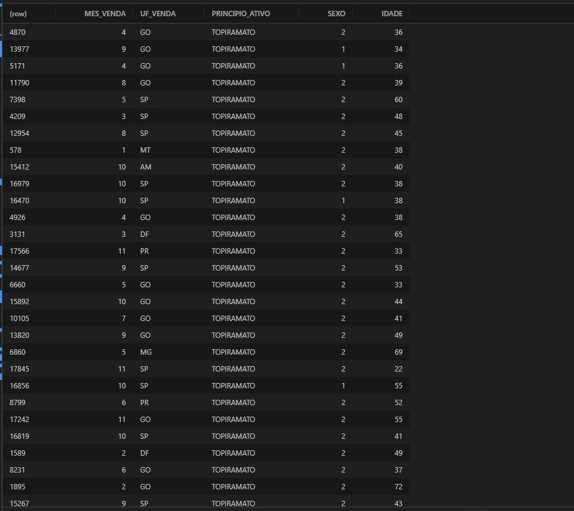

## Análise do Topiramato

Projeto acadêmico realizado no semestre 2023-1, na unidade curricular de Análise de Dados e Big Data utilizando R. O objetivo deste projeto foi desenvolver uma análise estatística para investigar o perfil dos consumidores do fármaco Topiramato, identificando possíveis diferenças de consumo entre diferentes faixas etárias (adultos e jovens) e explorando a influência do sexo na compra desse medicamento. O estudo visa fornecer insights sobre o uso do Topiramato, contribuindo para o entendimento de seu consumo e potencialmente auxiliando profissionais de saúde e formuladores de políticas públicas na melhor orientação de tratamentos.

##### Hipóteses:

H₀ (Hipótese nula): μA = μB (não há diferença significativa entre as médias de idade das duas populações).  
H₁ (Hipótese alternativa): μA ≠ μB (há diferença significativa entre as médias de idade das duas populações).

A hipótese proposta é que adultos (40 a 59 anos) consomem mais Topiramato em comparação a jovens (18 a 39 anos). A análise busca investigar se existem diferenças significativas no consumo desse medicamento entre essas duas faixas etárias.

##### Teste t de Student:

Fórmula do teste:  
t = (xA - xB) / √((sA²/nA) + (sB²/nB))

Onde:

- xA = 48,2533 (média dos adultos)  
- xB = 31,43845 (média dos jovens)  
- sA = 5,594633 (desvio padrão dos adultos)  
- sB = 5,540495 (desvio padrão dos jovens)  
- nA = 8705 (quantidade de adultos)  
- nB = 7547 (quantidade de jovens)  
- t calculado = 192,084

##### Graus de liberdade:

Fórmula dos graus de liberdade:  
gl = nA + nB - 2  
gl = 8705 + 7547 - 2 = 16250

##### Valor crítico:

Fórmula do valor crítico:  
qt(1 - α, gl)

O site "Statistic How To" [Statistic How To](https://www.statisticshowto.com/tables/t-distribution-table/#two) fornece tabelas de distribuição t de Student, que são usadas para encontrar valores críticos em testes estatísticos. Essas tabelas ajudam a determinar se um valor t calculado em um teste t (como o que compara médias de duas populações) é estatisticamente significativo, com base no número de graus de liberdade e no nível de significância (como 0,05).

Nível de significância α = 0,05  
Valor crítico qt(1 - 0,05, 16250) = 1,644947

### Resultado do teste t:

O valor t calculado (192,084) excede o valor crítico (1,644947), rejeitamos a hipótese nula (H₀) em favor da hipótese alternativa (H₁). Isso indica uma diferença estatisticamente significativa entre as médias de idade das duas populações. Portanto, temos evidências suficientes para afirmar que as médias de idade de adultos e jovens são diferentes, considerando um nível de significância de 5%.

### Solução de Rastreabilidade

A análise indica que a maioria dos consumidores do medicamento Topiramato nas duas faixas etárias é do sexo feminino. Isso pode oferecer insights valiosos para campanhas de saúde direcionadas a esses grupos.

### Código e Execução:

O código principal está disponível no formato `analise.R`. É possível executar o código instalando o R e utilizando o Visual Studio Code ou o RStudio. Se optar pelo Visual Studio Code, instale a extensão R de REditorSupport e execute o comando `install.packages("languageserver")` no terminal do R. Além disso, é necessário carregar a biblioteca `ggplot2` com o código `install.packages("ggplot2")` para visualizar gráficos e tabelas.

